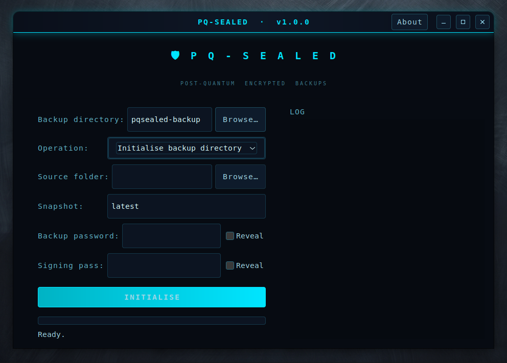

<div align="center">

<a href="https://github.com/effjy/pq-sealed/"></a>

**Incremental, post-quantum encrypted backups for your directories — with
signed, tamper-evident snapshots.**

Author: **Jean-Francois Lachance-Caumartin**

[](LICENSE)
[](#)
[](#)
[](#)
[](#)

[](#)
[](#)
[](#)
[-8a2be2.svg?style=flat-square)](#)
[](#)

</div>

---

PQ-Sealed backs up a directory into an encrypted, content-addressed **backup
directory**. Each backup is *incremental*: only files that are new or have
changed since the last snapshot are stored. Every file is sealed behind a
**Kyber-1024 + X448 hybrid KEM**, and every snapshot manifest is signed with
**ML-DSA-65 (FIPS 204)**, so backups are both confidential against a future
quantum adversary and verifiable against tampering.

It ships as a small GTK3 desktop app in the same style as the rest of the
tool-set (Ciphers, Axis, …).

---

## Screenshot

<div align="center">



*The PQ-Sealed main window — choose a backup directory, pick an operation
(initialise, back up, restore, list, verify), then run it with a live log.*

</div>

---

## How it works

A backup directory holds everything needed to store and restore snapshots:

```
<backup-dir>/PQSEALED              marker + format version
<backup-dir>/keyring               hybrid-KEM key-ring (see below)
<backup-dir>/keys/snapshot.pub     ML-DSA-65 public key (armored)
<backup-dir>/keys/snapshot.key     ML-DSA-65 secret key (passphrase-encrypted)
<backup-dir>/objects/<ab>/<hex>    sealed file contents, named by plaintext hash
<backup-dir>/snapshots/<stamp>.manifest{,.sig}
```

**One KDF + KEM per backup directory, not per file.** On initialisation, a
single Argon2id pass (1 GiB) over your backup password derives a master key.
That master key wraps a freshly generated Kyber-1024 + X448 hybrid secret key;
the KEM is encapsulated once to yield a 32-byte **data key**. Opening the backup
directory later re-derives the master key, unwraps the hybrid secret key, and
decapsulates back to the same data key. This is the per-file hybrid design of
*Ciphers* lifted to backup-directory scope — so the expensive KDF and the
post-quantum KEM run once per backup, never once per file.

**Content-addressed, deduplicating storage.** Every file is stored as an object
named by the SHA-256 of its *plaintext*, sealed with the data key using
libsodium's `secretstream` (XChaCha20-Poly1305, chunked and authenticated). If
an object with that hash already exists — from an earlier snapshot, or an
identical file elsewhere — it is not stored again. That is what makes backups
incremental and de-duplicated.

**Tamper-evident snapshots.** Each snapshot writes an encrypted manifest listing
every file and directory with its mode, size, mtime and content hash. The
manifest is signed with ML-DSA-65. *Verify* checks every signature with the
public key (no password needed); *restore* refuses to run on an invalid
signature, and re-checks every restored file's hash against the signed manifest.

**Hardened memory.** Passwords, the master key and the hybrid secret key live in
`mlock`-ed, non-dumpable pages and are zeroed on release; core dumps are
disabled.

---

## Building

Dependencies (all located via `pkg-config`):

- `gtk+-3.0` — the desktop GUI
- `libsodium` — secretstream, Argon2, RNG, BLAKE2b
- `libargon2` — Argon2id KDF
- `openssl` (≥ 3.0) — X448, SHA-256, AES-256-GCM (key armor)
- `liboqs` — ML-DSA / SLH-DSA signatures

### 1. Install the prerequisites

Copy-paste the line for your distribution. This also pulls in the build tools
(compiler, `make`, `pkg-config`) and the tools needed to build liboqs in step 2
(`git`, `cmake`, `ninja`).

**Debian / Ubuntu / Linux Mint / Pop!_OS**

```sh
sudo apt update
sudo apt install build-essential pkg-config git cmake ninja-build \
    libgtk-3-dev libsodium-dev libargon2-dev libssl-dev
```

**Fedora / RHEL / CentOS Stream**

```sh
sudo dnf install gcc make pkgconf-pkg-config git cmake ninja-build \
    gtk3-devel libsodium-devel libargon2-devel openssl-devel
```

**Arch / Manjaro**

```sh
sudo pacman -S --needed base-devel pkgconf git cmake ninja \
    gtk3 libsodium argon2 openssl
```

**openSUSE**

```sh
sudo zypper install gcc make pkg-config git cmake ninja \
    gtk3-devel libsodium-devel libargon2-devel libopenssl-devel
```

### 2. Install liboqs

liboqs (the post-quantum signature library) is rarely packaged by
distributions, so build it with the bundled script — it fetches and compiles
only the algorithms PQ-Sealed needs:

```sh
./setup-liboqs.sh                 # system-wide (/usr/local, uses sudo)
PREFIX="$PWD/.local" ./setup-liboqs.sh   # local, no root
```

### 3. Compile and install

```sh
make
sudo make install      # binary + icon + desktop entry
```

To remove it later:

```sh
sudo make uninstall
```

If you installed liboqs to a custom prefix in step 2, point `pkg-config` at it
when building (and set `LD_LIBRARY_PATH` to run it):

```sh
make PKG_CONFIG_PATH="$PWD/.local/lib/pkgconfig"
LD_LIBRARY_PATH="$PWD/.local/lib" ./pq-sealed
```

After `make install`, **PQ-Sealed** appears in the applications menu with its
icon, and the icon shows in the window title bar and taskbar.

---

## Using it

Launch **PQ-Sealed**, choose a *Backup directory* (where snapshots are stored),
then pick an operation:

| Operation | What it does |
|:---|:---|
| **Initialise backup directory** | Sets up the backup directory, the hybrid key-ring (asks for a backup password) and the ML-DSA-65 signing key (asks for a signing passphrase). |
| **Back up a folder** | Asks for the folder to back up and the backup password; stores only new/changed files and writes a signed snapshot. |
| **Restore a snapshot** | Decrypts a snapshot (default `latest`) into a chosen folder after verifying its signature. |
| **List snapshots** | Lists snapshots with size and signature status (public key only). |
| **Verify snapshots** | Checks every snapshot signature against the public key. |

Operations run on a worker thread with a live log, so the UI stays responsive
during the Argon2id KDF and large backups.

> **Use the same backup password each time.** Objects from earlier snapshots are
> sealed under the data key derived from the password chosen at initialisation;
> the backup password is fixed when the backup directory is created.

Symbolic links and special files are skipped (with a warning); regular files and
directory structure (modes, mtimes) are preserved.

---

## Credits

Built on the cryptographic engine of **Ciphers** (hybrid Kyber-1024 + X448 KEM)
and the signature/armor layer of **pq-sign** (ML-DSA / SLH-DSA via liboqs).

© 2026 Jean-Francois Lachance-Caumartin — MIT License.
